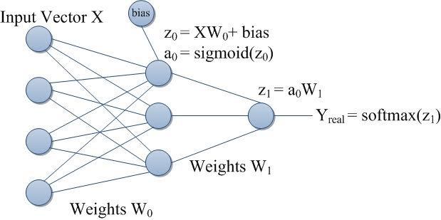

# neuralnet

A from scratch implementation of neural network with numpy. Quantity of layers and quantity of neurons per layer can be passed as a list to the create_network function :
- n_hidden being the quantity of layers in your network
- n_neurons being a list with quantity of neurons per layer

please follow https://smalldatabrains.com/python-neural-network/ for deeper explanation about mathematicals principles in neural network.

## To do list
- activation functions
    - sigmoid [x]
    - tanh [x]
    - softmax [x]
    - relu
- derivatives
    - dsigmoid [x]
    - dtanh [x]
    - dsoftmax
    - drelu
- loss function
    - MSE [x]
    - cross entropy

- model saving
- play with mnist drawings (draw.py interface)
